# Architecture: Intelligence Feed Data Flow

This diagram shows how the threat-intel skill, the MCP server, and external intelligence
feeds interact to produce a live-sourced threat intelligence report.

```mermaid
flowchart TD
    subgraph CC["Claude Code"]
        User["User\n/cyber-threat-intel"]
        Skill["Skill\nskills/cyber-threat-intel/SKILL.md"]
        Output["Output\nValidated against\noutput.schema.json"]
        Render["render/executive.py\npython -m threat_intel_mcp.render\nexecutive_overview: attached | separate\nself-contained HTML — NOT an MCP tool"]
        Prefetch["scheduled-report.yml : job 1 of 2\nprefetch — HOLDS the feed credentials\nfixed script, no agent\nmcp/scripts/prefetch_feeds.py\n→ feed-data.json artifact"]
        Sched["scheduled-report.yml : job 2 of 2\ngenerate — the agent. NO credentials,\nno MCP feed server. Reads feed-data.json\nreport → report-output/ (gitignored)\n→ run summary — never reports/"]
    end
    subgraph Verify["Offline verification (no live network in CI)"]
        Reports["reports/\nFROZEN corpus of 11\n(count pinned by CI)"]
        Evals["evals/\ninvariants.py — R1-R6 over real output\nrun.py --corpus (PR-gated)\nrun.py --scenario (model call)"]
        Cassettes["tests/cassettes/ (vcrpy)\nbytes the feeds actually sent\nreplayed offline, record_mode=none\n3 of 12 adapters recorded"]
    end

    subgraph MCP["threat-intel-mcp (stdio transport)"]
        Server["MCP Server\nserver.py\nIOC tools: qfeeds_fetch_iocs\n       abuseipdb_fetch_blocklist\n       virustotal_fetch_iocs\n       otx_fetch_iocs\n       shodan_fetch_iocs\n       greynoise_fetch_iocs\n       anyrun_fetch_iocs\n       intel471_fetch_iocs\n       censys_fetch_iocs\n       threatfox_fetch_iocs\n       fetch_all_iocs\nCVE tools: cisa_kev_fetch_cves\n       nvd_fetch_cves\n       vulncheck_fetch_cves\n       fetch_all_cves\n       list_available_feeds"]

        FanOut["fetch_all_iocs fan-out\nfanout.py\nasyncio.gather over all sources\nmerge + cross-source dedup"]
        VulnFanOut["fetch_all_cves fan-out\nvulns.py\nfan_out_vulns over CVE sources\nmerge + dedup by CVE ID"]
        Resilience["resilience.py\nguarded_fetch per source\nCircuitBreaker + backoff retry"]

        subgraph Cred["CredentialProvider"]
            EnvCred["Phase 1: EnvCredentialProvider\nreads QFEEDS_API_KEY\nreads ABUSEIPDB_API_KEY\nreads VIRUSTOTAL_API_KEY\nreads OTX_API_KEY\nreads SHODAN_API_KEY\nreads GREYNOISE_API_KEY\nreads ANYRUN_API_KEY\nreads INTEL471_* / CENSYS_*\nreads NVD_API_KEY (optional)\nreads VULNCHECK_API_KEY"]
            VaultCred["Phase 2: VaultCredentialProvider\nreads from HashiCorp Vault"]
        end

        subgraph Adapters["Adapters"]
            QFeeds["QFeedsAdapter\nadapters/qfeeds.py\nHTTP Basic auth\n20-min cache"]
            AbuseIPDB["AbuseIPDBAdapter\nadapters/abuseipdb.py\nHeader Key auth\n60-min cache"]
            VT["VirusTotalAdapter\nadapters/virustotal.py\nx-apikey header\n15-min cache\n15s rate limit"]
            OTX["OTXAdapter\nadapters/otx.py\nX-OTX-API-KEY header\n60-min cache"]
            Shodan["ShodanAdapter\nadapters/shodan.py\nkey query param (log-redacted)\n60-min cache"]
            GreyNoise["GreyNoiseAdapter\nadapters/greynoise.py\nkey header\nGNQL classification:malicious\n60-min cache"]
            ThreatFox["ThreatFoxAdapter\nadapters/threatfox.py\npublic CSV (no key)\n15-min cache"]
            AnyRun["AnyRunAdapter\nadapters/anyrun.py\nTAXII2 STIX\n60-min cache"]
            Intel471["Intel471Adapter\nadapters/intel471.py\nHTTP Basic\nindicators/stream\n60-min cache"]
            Censys["CensysAdapter\nadapters/censys.py\nHTTP Basic\nhosts/search labels:malware\n60-min cache"]
            MISPZMQ["MISPZMQAdapter\ntransports/misp_zmq.py\nfirst concrete ProtocolAdapter\nzmq.SUB · NO credential\nbounded collection window"]
        end
        GuardParsed["adapters/base.py\nguard_parsed\nitems present, none understood\n→ UpstreamFormatError (degrade + retry)\nnothing present → honest 0"]

        subgraph VulnAdapters["CVE Adapters (Tier 1 gov)"]
            CISAKEV["CISAKEVAdapter\nadapters/cisa_kev.py\npublic JSON (no key)\nexploit_status=known_exploited\n6-hr cache"]
            NVD["NVDAdapter\nadapters/nvd.py\napiKey header (OPTIONAL)\nNVD 2.0 lastMod window\n60-min cache"]
        end

        Normalize["normalize.py\nfinalize_iocs:\nsanitize + validate + dedupe\nioc_network schema"]
        VulnNormalize["vulns.py\nfinalize_vulns:\nsanitize + validate + dedupe\nCVE-keyed vuln record schema"]
        FetchResult["FetchResult\niocs · source · tier\nrecord_count · retrieved_at"]
        VulnFetchResult["VulnFetchResult\nvulns · source · tier\nrecord_count · retrieved_at"]
    end

    subgraph Ext["External Feeds"]
        QFeedsAPI["Q-Feeds API\nhttps://api.qfeeds.com/api\npaginated · malware_ip · malware_domains"]
        AbuseIPDB_API["AbuseIPDB API\nhttps://api.abuseipdb.com/api/v2/blacklist\nsingle request · up to 10,000 IPs"]
        VT_API["VirusTotal API v3\nhttps://www.virustotal.com/api/v3\nfeeds/malicious_ips · feeds/malicious_domains\nnewline-delimited JSON"]
        OTX_API["AlienVault OTX API\nhttps://otx.alienvault.com/api/v1\nGET /pulses/subscribed · paginated"]
        Shodan_API["Shodan API\nhttps://api.shodan.io\nGET /shodan/host/search · category:malware · paginated"]
        GreyNoise_API["GreyNoise API\nhttps://api.greynoise.io\nGET /v3/gnql · classification:malicious · scroll paginated"]
        ThreatFox_API["ThreatFox feed\nhttps://threatfox.abuse.ch/export/csv/recent/\npublic CSV"]
        AnyRun_API["ANY.RUN API\nhttps://api.any.run/v1\nGET /feeds/taxii2/... · STIX"]
        Intel471_API["Intel 471 API\nhttps://api.intel471.com/v1\nGET /indicators/stream · cursor"]
        Censys_API["Censys API v2\nhttps://search.censys.io/api/v2\nGET /hosts/search · labels:malware"]
        CISAKEV_API["CISA KEV catalog\nhttps://www.cisa.gov/sites/default/files/feeds/\nknown_exploited_vulnerabilities.json\npublic JSON"]
        NVD_API["NIST NVD API 2.0\nhttps://services.nvd.nist.gov/rest/json/cves/2.0\nlastModStartDate/EndDate · paginated"]
        MISP_EP["MISP ZeroMQ pub-sub\noperator-supplied tcp:// endpoint\nmisp_json · misp_json_attribute\nmisp_json_self keep-alive (1/min)"]
    end

    User -->|"invokes skill"| Skill
    Skill -->|"calls MCP tool"| Server
    Server -->|"fetch_all_iocs"| FanOut
    Server -->|"fetch_all_cves"| VulnFanOut
    FanOut -->|"concurrent per-source call"| Resilience
    VulnFanOut -->|"concurrent per-source call"| Resilience
    Resilience -->|"guarded_fetch"| QFeeds
    Resilience -->|"guarded_fetch"| AbuseIPDB
    Resilience -->|"guarded_fetch"| VT
    Resilience -->|"guarded_fetch"| OTX
    Resilience -->|"guarded_fetch"| Shodan
    Resilience -->|"guarded_fetch"| GreyNoise
    Resilience -->|"guarded_fetch"| ThreatFox
    Resilience -->|"guarded_fetch"| AnyRun
    Resilience -->|"guarded_fetch"| Intel471
    Resilience -->|"guarded_fetch"| Censys
    Resilience -->|"guarded_fetch"| CISAKEV
    Resilience -->|"guarded_fetch"| NVD
    FanOut -->|"merged + deduped IOCs\npartial/open-circuit -> coverage_ledger"| Server
    VulnFanOut -->|"merged + deduped CVEs\npartial/open-circuit -> coverage_ledger"| Server
    Server --> EnvCred
    Server -.->|"Phase 2"| VaultCred
    EnvCred -->|"api_key"| QFeeds
    EnvCred -->|"api_key"| AbuseIPDB
    EnvCred -->|"api_key"| VT
    EnvCred -->|"api_key"| OTX
    EnvCred -->|"api_key"| Shodan
    EnvCred -->|"api_key"| GreyNoise
    EnvCred -->|"api_key"| AnyRun
    EnvCred -->|"api_key"| Intel471
    EnvCred -->|"api_key"| Censys
    EnvCred -.->|"api_key (optional)"| NVD
    VaultCred -.->|"api_key (Phase 2)"| QFeeds
    VaultCred -.->|"api_key (Phase 2)"| AbuseIPDB
    VaultCred -.->|"api_key (Phase 2)"| VT
    VaultCred -.->|"api_key (Phase 2)"| OTX
    VaultCred -.->|"api_key (Phase 2)"| Shodan
    VaultCred -.->|"api_key (Phase 2)"| GreyNoise
    VaultCred -.->|"api_key (Phase 2)"| AnyRun
    VaultCred -.->|"api_key (Phase 2)"| Intel471
    VaultCred -.->|"api_key (Phase 2)"| Censys
    VaultCred -.->|"api_key (Phase 2, optional)"| NVD
    QFeeds -->|"GET /api?feed_type=..&page=N"| QFeedsAPI
    QFeedsAPI -->|"plain-text indicators"| QFeeds
    AbuseIPDB -->|"GET /blacklist?confidenceMinimum=90"| AbuseIPDB_API
    AbuseIPDB_API -->|"JSON IP entries"| AbuseIPDB
    VT -->|"GET /feeds/{feed_type}?cursor=..&limit=40"| VT_API
    VT_API -->|"newline-delimited JSON"| VT
    OTX -->|"GET /pulses/subscribed?modified_since=.."| OTX_API
    OTX_API -->|"JSON pulses + indicators"| OTX
    Shodan -->|"GET /shodan/host/search?query=category:malware"| Shodan_API
    Shodan_API -->|"JSON matches"| Shodan
    GreyNoise -->|"GET /v3/gnql?query=classification:malicious"| GreyNoise_API
    GreyNoise_API -->|"JSON data records"| GreyNoise
    ThreatFox -->|"GET /export/csv/recent/ (no auth)"| ThreatFox_API
    ThreatFox_API -->|"CSV rows"| ThreatFox
    AnyRun -->|"GET /feeds/taxii2/.../objects"| AnyRun_API
    AnyRun_API -->|"STIX objects"| AnyRun
    Intel471 -->|"GET /indicators/stream"| Intel471_API
    Intel471_API -->|"JSON indicators"| Intel471
    Censys -->|"GET /hosts/search?q=labels:malware"| Censys_API
    Censys_API -->|"JSON result.hits"| Censys
    CISAKEV -->|"GET known_exploited_vulnerabilities.json (no auth)"| CISAKEV_API
    CISAKEV_API -->|"JSON vulnerabilities[]"| CISAKEV
    NVD -->|"GET /cves/2.0?lastModStartDate=..&startIndex=N"| NVD_API
    NVD_API -->|"JSON vulnerabilities[]"| NVD
    QFeeds -->|"raw ioc_network objects"| Normalize
    AbuseIPDB -->|"raw ioc_network objects"| Normalize
    VT -->|"raw ioc_network objects"| Normalize
    OTX -->|"raw ioc_network objects"| Normalize
    Shodan -->|"raw ioc_network objects"| Normalize
    GreyNoise -->|"raw ioc_network objects"| Normalize
    ThreatFox -->|"raw ioc_network objects"| Normalize
    AnyRun -->|"raw ioc_network objects"| Normalize
    Intel471 -->|"raw ioc_network objects"| Normalize
    Censys -->|"raw ioc_network objects"| Normalize
    CISAKEV -->|"raw vuln records"| VulnNormalize
    NVD -->|"raw vuln records"| VulnNormalize
    Normalize -->|"validated + deduped IOCs"| FetchResult
    VulnNormalize -->|"validated + deduped CVEs"| VulnFetchResult
    FetchResult -->|"iocs · coverage_ledger_entry"| Server
    VulnFetchResult -->|"vulns · coverage_ledger_entry"| Server
    Server -->|"FetchResult / VulnFetchResult dict"| Skill
    Skill -->|"cites sources: Q-Feeds / AbuseIPDB / VirusTotal / OTX / Shodan / GreyNoise / ANY.RUN / Intel 471 / Censys / ThreatFox (IOCs) · CISA KEV / NVD (CVEs) (live)\nincorporates IOCs + vulnerabilities into report"| Output
    Output -->|"validated JSON"| User
    Resilience -->|"guarded_fetch"| MISPZMQ
    MISPZMQ -->|"SUBSCRIBE b'' · single frame\ntopic SPACE json"| MISP_EP
    Adapters -.->|"every parse routes through"| GuardParsed
    VulnAdapters -.->|"every parse routes through"| GuardParsed
    GuardParsed -->|"understood records"| Normalize
    GuardParsed -->|"understood records"| VulnNormalize
    Output -->|"same validated object,\nnever a second document"| Render
    Prefetch -.->|"feed-data.json artifact\n(data only, no credential)"| Sched
    Sched -.->|"invokes the skill\nreading the file, not fetching"| Skill
    Ext -.->|"recorded once (record-cassettes workflow)"| Cassettes
    Cassettes -.->|"replayed in mcp/tests"| Adapters
    Output -.->|"11 committed, then frozen"| Reports
    Reports -->|"8 hard invariants, every PR"| Evals
```

## Component Notes

| Component | File | Role |
|-----------|------|------|
| Skill | `skills/cyber-threat-intel/SKILL.md` | Entrypoint; guides analysis workflow and report structure |
| Plugin manifest | `.claude-plugin/plugin.json` | Makes the repo installable as a Claude Code plugin — the only way a clone exposes the skill as a slash command, since a top-level `skills/` directory is not a skill-discovery location. Plugin skills resolve at `<plugin-root>/skills/<name>/SKILL.md`, matching the existing layout. Also declares the bundled `threat-intel` MCP server, launched as `python -m threat_intel_mcp`. `claude --plugin-dir .` loads it from a clone |
| Module entry point | `mcp/src/threat_intel_mcp/__main__.py` | `python -m threat_intel_mcp`, re-exporting `server:main`. Resolves through the interpreter rather than `PATH`, so the server starts where the console-script shim is installed but unreachable (Windows Store Python) |
| Live feed check | `.github/workflows/live-feed-check.yml` · `mcp/tests/test_live_feeds.py` | Weekly `pytest -m live` against the real keyless endpoints, asserting non-empty parse **and** survival through `finalize_iocs`/`finalize_vulns`. Deselected from PR CI by `addopts = -m 'not live'`. Opens/bumps a `Live feed check failing` issue, closes it on recovery |
| MCP Server | `mcp/src/threat_intel_mcp/server.py` | FastMCP stdio server; exposes IOC tools `qfeeds_fetch_iocs`, `abuseipdb_fetch_blocklist`, `virustotal_fetch_iocs`, `otx_fetch_iocs`, `shodan_fetch_iocs`, `greynoise_fetch_iocs`, `anyrun_fetch_iocs`, `intel471_fetch_iocs`, `censys_fetch_iocs`, `threatfox_fetch_iocs`, `fetch_all_iocs`; CVE tools `cisa_kev_fetch_cves`, `nvd_fetch_cves`, `vulncheck_fetch_cves`, `fetch_all_cves`; and `list_available_feeds` |
| Fan-out | `mcp/src/threat_intel_mcp/fanout.py` | `fetch_all_iocs` backend: runs every configured adapter concurrently via `asyncio.gather`, validates + dedupes per source, merges into one deduplicated set, surfaces degraded sources to the Coverage Ledger |
| Vuln fan-out + pipeline | `mcp/src/threat_intel_mcp/vulns.py` | `fetch_all_cves` backend: `fan_out_vulns` over the CVE sources (same `CircuitBreaker`/`guarded_fetch` resilience), plus `finalize_vulns` = sanitize → validate against the inline CVE-keyed vuln-record schema → dedupe by CVE ID (keeps highest CVSS, folds in KEV exploit-status/due-date). Emits vulnerability records, not `ioc_network` |
| Resilience | `mcp/src/threat_intel_mcp/resilience.py` | `CircuitBreaker` (closed/open/half-open) + `retry_with_backoff` (exponential backoff + jitter) wrapped by `guarded_fetch`; isolates one flaky feed from the rest. Whether a failure retries / trips the breaker follows the adapter **error taxonomy** in `adapters/base.py`: `ValueError` = caller error (surfaced), `CredentialError`/`KeyError` = config (degrade, no retry), anything else incl. a malformed body = upstream (degrade, retry) |
| Protocol credentials | `mcp/src/threat_intel_mcp/vault/protocols.py` | Typed, validated credential bundles for gRPC / MQTT / WebSocket / GraphQL feeds, loaded via the same `CredentialProvider` |
| Protocol adapter base | `mcp/src/threat_intel_mcp/transports/base.py` | `ProtocolAdapter`: abstract bring-your-own-endpoint `SourceAdapter` (impl `_collect` + `_normalize`); ships **no live feed / no hardcoded endpoint**. See [protocol-adapters.md](protocol-adapters.md) |
| MISP ZeroMQ adapter | `mcp/src/threat_intel_mcp/transports/misp_zmq.py` | Issue #162, the first concrete `ProtocolAdapter`. Subscribes `zmq.SUB` for a bounded window and parses MISP's single-frame `topic SPACE json` framing (verified against `MISP/tools/misp-zmq/sub.py`, not assumed — a multipart reader gets nothing). Honours MISP's own `to_ids` flag, which is a **string** `"1"`/`"0"`: a truthiness check would treat `"0"` as True and emit every non-actionable attribute. **Uses no credentials** — MISP ZMQ has no auth — so it proves the transport, not the credential path. Endpoint is operator-supplied; no hostname is committed |
| Executive renderer | `mcp/src/threat_intel_mcp/render/executive.py` | Issues #110 and #168: renders an `enterprise_executive` output as a self-contained landscape HTML page. Driven by the `executive_overview` skill input (`off` | `attached` | `separate`) — `output_format` still names the *primary* deliverable, and this is additive, so one run yields both. The overview is a **projection of the same validated output object**, never a second document, which is what stops the two artifacts disagreeing; five consistency invariants are asserted in `evals/` (`check_paired_artifacts`). Page (no external stylesheet, script, font or image). CLI: `python -m threat_intel_mcp.render in.json -o out.html`. **Deliberately not an MCP tool** — the tool surface is the *feed* contract, mirrored in both skill files and asserted by the skill↔server parity test (#79); rendering is a local transform of data the caller already holds. Risk bands use a sequential single-hue ramp, not red/amber/green: status hues are non-monotonic in lightness (moderate is *lighter* than low and high) and collapse in greyscale. Nothing is encoded by colour alone; modelled figures carry a `MODELLED` chip in the tile; an absent coverage badge renders as `COVERAGE NOT REPORTED` rather than defaulting |
| Skill-output evals | `evals/` | Issue #83: the honesty half of CI. `invariants.py` asserts R1-R6 properties over a generated report — badge present and not over-claimed, Appendix A present, an explicit no-fabrication claim, no reserved-range/filler indicators, sparse reports stating sparsity in prose. `run.py --corpus` runs offline over every committed report and is PR-gated; `run.py --scenario KEY` invokes the skill (model call, on demand). Badge checking is **directional** — over-claiming fails, under-claiming is a style note — and matching is on substance across real phrasings rather than exact labels |
| Pipeline duplication guard | `mcp/tests/test_pipeline_duplication.py` | Issue #84's acceptance criteria, made mechanical. The IOC (`fanout.py`) and CVE (`vulns.py`) pipelines are a **sanctioned pair**; a third copy of the `_SUMMARY_KEYS`/`_degraded`/`_run_source` signature fails the build with the refactor plan. Also guards the risk #84 does not name — the two copies **diverging**, since a fix landing in one and not the other is invisible while both keep passing their own tests. Compared as control-flow shape (identifiers and constants stripped), because text similarity has no usable threshold: the copies sit at 96% and a real four-line drift only reached 91.5% |
| EnvCredentialProvider | `mcp/src/threat_intel_mcp/vault/env.py` | Phase 1: reads `QFEEDS_API_KEY`, `ABUSEIPDB_API_KEY`, `VIRUSTOTAL_API_KEY`, `OTX_API_KEY`, `SHODAN_API_KEY`, `GREYNOISE_API_KEY`, `ANYRUN_API_KEY`, `INTEL471_*`, `CENSYS_*`, `VULNCHECK_API_KEY`, and (optional) `NVD_API_KEY` from environment |
| VaultCredentialProvider | `mcp/src/threat_intel_mcp/vault/` | Phase 2: reads credentials from HashiCorp Vault |
| QFeedsAdapter | `mcp/src/threat_intel_mcp/adapters/qfeeds.py` | Fetches paginated malware IP and domain feeds; 20-min in-process cache |
| AbuseIPDBAdapter | `mcp/src/threat_intel_mcp/adapters/abuseipdb.py` | Fetches IP blacklist (up to 10,000 IPs, confidenceMinimum=90); 60-min in-process cache |
| VirusTotalAdapter | `mcp/src/threat_intel_mcp/adapters/virustotal.py` | Fetches recent malicious IPs and domains from VT Intelligence feeds; 15-min cache; 15s inter-request rate limit |
| OTXAdapter | `mcp/src/threat_intel_mcp/adapters/otx.py` | Fetches subscribed OTX pulses (IPv4, IPv6, Domain, URL); 60-min in-process cache |
| ShodanAdapter | `mcp/src/threat_intel_mcp/adapters/shodan.py` | Fetches Malware Hunter C2/infrastructure detections (`category:malware`); key rides in the query string and is redacted from all logging; 60-min in-process cache |
| GreyNoiseAdapter | `mcp/src/threat_intel_mcp/adapters/greynoise.py` | Runs GNQL `classification:malicious` (`/v3/gnql`) for confirmed-malicious scanners; header `key` auth; 60-min in-process cache |
| ThreatFoxAdapter | `mcp/src/threat_intel_mcp/adapters/threatfox.py` | Recent malicious network IOCs from the **public** abuse.ch CSV feed (hashes excluded, no credential); 15-min cache. CSV is read with `skipinitialspace=True` — abuse.ch quotes fields and separates them with comma-then-space, and the default dialect parses the whole feed to nothing. Raises `RuntimeError` when data rows are present but none carry a known `ioc_type`, so a format break degrades rather than reporting `0 records` |
| AnyRunAdapter | `mcp/src/threat_intel_mcp/adapters/anyrun.py` | Fetches ANY.RUN TAXII 2.1 STIX feed (ip/domain/url collections); STIX patterns parsed via `stix_patterns.py`; 60-min cache |
| Intel471Adapter | `mcp/src/threat_intel_mcp/adapters/intel471.py` | Fetches Titan `indicators/stream` (HTTP Basic, cursor pagination); maps IP + URL indicators; 60-min cache |
| CensysAdapter | `mcp/src/threat_intel_mcp/adapters/censys.py` | Searches v2 hosts `labels:malware/c2` (HTTP Basic id+secret); attack-surface, action=alert; 60-min cache |
| CISAKEVAdapter | `mcp/src/threat_intel_mcp/adapters/cisa_kev.py` | Fetches the **public** CISA KEV catalog JSON (no credential); every entry `exploit_status: known_exploited` with KEV due-date/required-action/ransomware flag; 6-hr cache |
| NVDAdapter | `mcp/src/threat_intel_mcp/adapters/nvd.py` | Fetches NVD 2.0 recently-modified CVEs (lastMod window ≤120d, paginated) with CVSS/CWEs/references; `apiKey` header **optional** (unauthenticated at lower rate limit); 60-min cache |
| Feed cassettes | `mcp/tests/cassettes/` · `mcp/tests/vcr_config.py` · `mcp/scripts/record_cassettes.py` | Recorded real feed responses replayed offline (`record_mode="none"`), so adapter parsing is tested against captured bytes rather than authored fixtures. Recorded via the `record-cassettes` workflow (runners have the egress the dev sandbox lacks); credentials are scrubbed by `vcr_config` and the scrubbing is asserted in CI |
| Empty-parse guard | `mcp/src/threat_intel_mcp/adapters/base.py` | `guard_parsed` + `UpstreamFormatError`. Every adapter routes its parse through it, so a 200 whose body carries no recognisable records raises (degrade + retry) instead of reporting a confident `0 records`. Genuinely empty feeds and understood-but-filtered batches still return `0` |
| normalize.py | `mcp/src/threat_intel_mcp/normalize.py` | `finalize_iocs` = sanitize → validate against inline `ioc_network` schema → deduplicate by `(type, value)` (corroboration-preserving); the single pipeline used by every IOC tool, the fan-out, and protocol adapters |
| vulns.py | `mcp/src/threat_intel_mcp/vulns.py` | CVE-keyed vulnerability-output path: `finalize_vulns` (sanitize → validate against inline vuln-record schema → dedupe by CVE ID) + `fan_out_vulns` (resilient concurrent fan-out); the vuln counterpart to `normalize.py`/`fanout.py`. Reuses `sanitize.py` helpers |
| sanitize.py | `mcp/src/threat_intel_mcp/sanitize.py` | Strips control / zero-width / bidi characters and caps lengths on feed-controlled free-text; drops IOCs whose value cleans to empty (runtime R6 defence). Its `_clean_str`/`_strip_chars` helpers are reused by `vulns.py` |
| netpolicy.py | `mcp/src/threat_intel_mcp/netpolicy.py` | Per-adapter egress allowlist enforced as an httpx request hook — blocks outbound requests to non-allowlisted hosts before they leave the process |
| FetchResult | `mcp/src/threat_intel_mcp/adapters/base.py` | Dataclass: `iocs`, `source`, `tier`, `record_count`, `retrieved_at`, `latency_ms` |
| VulnFetchResult | `mcp/src/threat_intel_mcp/vulns.py` | Dataclass: `vulns`, `source`, `tier`, `record_count`, `retrieved_at`, `latency_ms` (the vuln counterpart to `FetchResult`) |
| Output schema | `skills/cyber-threat-intel/schemas/output.schema.json` | JSON Schema the final report is validated against |
