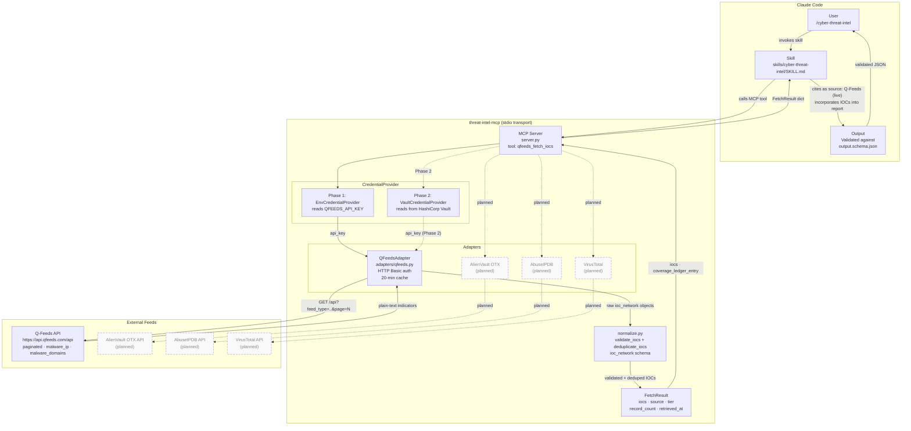

# Architecture: Intelligence Feed Data Flow

This diagram shows how the threat-intel skill, the MCP server, and external intelligence
feeds interact to produce a live-sourced threat intelligence report.

## Component Notes

| Component | File | Role |
|-----------|------|------|
| Skill | `skills/cyber-threat-intel/SKILL.md` | Entrypoint; guides analysis workflow and report structure |
| MCP Server | `mcp/src/threat_intel_mcp/server.py` | FastMCP stdio server; exposes `qfeeds_fetch_iocs` and `list_available_feeds` |
| EnvCredentialProvider | `mcp/src/threat_intel_mcp/vault/env.py` | Phase 1: reads `QFEEDS_API_KEY` from environment |
| VaultCredentialProvider | `mcp/src/threat_intel_mcp/vault/` | Phase 2: reads credentials from HashiCorp Vault (planned) |
| QFeedsAdapter | `mcp/src/threat_intel_mcp/adapters/qfeeds.py` | Fetches paginated malware IP and domain feeds; 20-min in-process cache |
| normalize.py | `mcp/src/threat_intel_mcp/normalize.py` | Validates `ioc_network` objects against inline schema; deduplicates by `(type, value)` |
| FetchResult | `mcp/src/threat_intel_mcp/adapters/base.py` | Dataclass: `iocs`, `source`, `tier`, `record_count`, `retrieved_at`, `latency_ms` |
| Output schema | `skills/cyber-threat-intel/schemas/output.schema.json` | JSON Schema the final report is validated against |

Dashed boxes and dashed arrows indicate components planned for a future phase but not yet implemented.
