# Architecture: Intelligence Feed Data Flow

This diagram shows how the threat-intel skill, the MCP server, and external intelligence
feeds interact to produce a live-sourced threat intelligence report.

```mermaid
flowchart TD
    subgraph CC["Claude Code"]
        User["User\n/cyber-threat-intel"]
        Skill["Skill\nskills/cyber-threat-intel/SKILL.md"]
        Output["Output\nValidated against\noutput.schema.json"]
    end

    subgraph MCP["threat-intel-mcp (stdio transport)"]
        Server["MCP Server\nserver.py\ntools: qfeeds_fetch_iocs\n       abuseipdb_fetch_blocklist\n       virustotal_fetch_iocs\n       otx_fetch_iocs\n       shodan_fetch_iocs\n       greynoise_fetch_iocs\n       anyrun_fetch_iocs\n       intel471_fetch_iocs\n       censys_fetch_iocs\n       urlhaus_fetch_iocs\n       threatfox_fetch_iocs\n       fetch_all_iocs\n       list_available_feeds"]

        FanOut["fetch_all_iocs fan-out\nfanout.py\nasyncio.gather over all sources\nmerge + cross-source dedup"]
        Resilience["resilience.py\nguarded_fetch per source\nCircuitBreaker + backoff retry"]

        subgraph Cred["CredentialProvider"]
            EnvCred["Phase 1: EnvCredentialProvider\nreads QFEEDS_API_KEY\nreads ABUSEIPDB_API_KEY\nreads VIRUSTOTAL_API_KEY\nreads OTX_API_KEY\nreads SHODAN_API_KEY\nreads GREYNOISE_API_KEY\nreads ANYRUN_API_KEY\nreads INTEL471_* / CENSYS_*"]
            VaultCred["Phase 2: VaultCredentialProvider\nreads from HashiCorp Vault"]
        end

        subgraph Adapters["Adapters"]
            QFeeds["QFeedsAdapter\nadapters/qfeeds.py\nHTTP Basic auth\n20-min cache"]
            AbuseIPDB["AbuseIPDBAdapter\nadapters/abuseipdb.py\nHeader Key auth\n60-min cache"]
            VT["VirusTotalAdapter\nadapters/virustotal.py\nx-apikey header\n15-min cache\n15s rate limit"]
            OTX["OTXAdapter\nadapters/otx.py\nX-OTX-API-KEY header\n60-min cache"]
            Shodan["ShodanAdapter\nadapters/shodan.py\nkey query param (log-redacted)\n60-min cache"]
            GreyNoise["GreyNoiseAdapter\nadapters/greynoise.py\nkey header\nGNQL classification:malicious\n60-min cache"]
            URLhaus["URLhausAdapter\nadapters/urlhaus.py\npublic CSV (no key)\n15-min cache"]
            ThreatFox["ThreatFoxAdapter\nadapters/threatfox.py\npublic CSV (no key)\n15-min cache"]
            AnyRun["AnyRunAdapter\nadapters/anyrun.py\nTAXII2 STIX\n60-min cache"]
            Intel471["Intel471Adapter\nadapters/intel471.py\nHTTP Basic\nindicators/stream\n60-min cache"]
            Censys["CensysAdapter\nadapters/censys.py\nHTTP Basic\nhosts/search labels:malware\n60-min cache"]
        end

        Normalize["normalize.py\nfinalize_iocs:\nsanitize + validate + dedupe\nioc_network schema"]
        FetchResult["FetchResult\niocs · source · tier\nrecord_count · retrieved_at"]
    end

    subgraph Ext["External Feeds"]
        QFeedsAPI["Q-Feeds API\nhttps://api.qfeeds.com/api\npaginated · malware_ip · malware_domains"]
        AbuseIPDB_API["AbuseIPDB API\nhttps://api.abuseipdb.com/api/v2/blacklist\nsingle request · up to 10,000 IPs"]
        VT_API["VirusTotal API v3\nhttps://www.virustotal.com/api/v3\nfeeds/malicious_ips · feeds/malicious_domains\nnewline-delimited JSON"]
        OTX_API["AlienVault OTX API\nhttps://otx.alienvault.com/api/v1\nGET /pulses/subscribed · paginated"]
        Shodan_API["Shodan API\nhttps://api.shodan.io\nGET /shodan/host/search · category:malware · paginated"]
        GreyNoise_API["GreyNoise API\nhttps://api.greynoise.io\nGET /v3/gnql · classification:malicious · scroll paginated"]
        URLhaus_API["URLhaus feed\nhttps://urlhaus.abuse.ch/downloads/csv_recent/\npublic CSV"]
        ThreatFox_API["ThreatFox feed\nhttps://threatfox.abuse.ch/export/csv/recent/\npublic CSV"]
        AnyRun_API["ANY.RUN API\nhttps://api.any.run/v1\nGET /feeds/taxii2/... · STIX"]
        Intel471_API["Intel 471 API\nhttps://api.intel471.com/v1\nGET /indicators/stream · cursor"]
        Censys_API["Censys API v2\nhttps://search.censys.io/api/v2\nGET /hosts/search · labels:malware"]
    end

    User -->|"invokes skill"| Skill
    Skill -->|"calls MCP tool"| Server
    Server -->|"fetch_all_iocs"| FanOut
    FanOut -->|"concurrent per-source call"| Resilience
    Resilience -->|"guarded_fetch"| QFeeds
    Resilience -->|"guarded_fetch"| AbuseIPDB
    Resilience -->|"guarded_fetch"| VT
    Resilience -->|"guarded_fetch"| OTX
    Resilience -->|"guarded_fetch"| Shodan
    Resilience -->|"guarded_fetch"| GreyNoise
    Resilience -->|"guarded_fetch"| URLhaus
    Resilience -->|"guarded_fetch"| ThreatFox
    Resilience -->|"guarded_fetch"| AnyRun
    Resilience -->|"guarded_fetch"| Intel471
    Resilience -->|"guarded_fetch"| Censys
    FanOut -->|"merged + deduped IOCs\npartial/open-circuit -> coverage_ledger"| Server
    Server --> EnvCred
    Server -.->|"Phase 2"| VaultCred
    EnvCred -->|"api_key"| QFeeds
    EnvCred -->|"api_key"| AbuseIPDB
    EnvCred -->|"api_key"| VT
    EnvCred -->|"api_key"| OTX
    EnvCred -->|"api_key"| Shodan
    EnvCred -->|"api_key"| GreyNoise
    EnvCred -->|"api_key"| AnyRun
    EnvCred -->|"api_key"| Intel471
    EnvCred -->|"api_key"| Censys
    VaultCred -.->|"api_key (Phase 2)"| QFeeds
    VaultCred -.->|"api_key (Phase 2)"| AbuseIPDB
    VaultCred -.->|"api_key (Phase 2)"| VT
    VaultCred -.->|"api_key (Phase 2)"| OTX
    VaultCred -.->|"api_key (Phase 2)"| Shodan
    VaultCred -.->|"api_key (Phase 2)"| GreyNoise
    VaultCred -.->|"api_key (Phase 2)"| AnyRun
    VaultCred -.->|"api_key (Phase 2)"| Intel471
    VaultCred -.->|"api_key (Phase 2)"| Censys
    QFeeds -->|"GET /api?feed_type=..&page=N"| QFeedsAPI
    QFeedsAPI -->|"plain-text indicators"| QFeeds
    AbuseIPDB -->|"GET /blacklist?confidenceMinimum=90"| AbuseIPDB_API
    AbuseIPDB_API -->|"JSON IP entries"| AbuseIPDB
    VT -->|"GET /feeds/{feed_type}?cursor=..&limit=40"| VT_API
    VT_API -->|"newline-delimited JSON"| VT
    OTX -->|"GET /pulses/subscribed?modified_since=.."| OTX_API
    OTX_API -->|"JSON pulses + indicators"| OTX
    Shodan -->|"GET /shodan/host/search?query=category:malware"| Shodan_API
    Shodan_API -->|"JSON matches"| Shodan
    GreyNoise -->|"GET /v3/gnql?query=classification:malicious"| GreyNoise_API
    GreyNoise_API -->|"JSON data records"| GreyNoise
    URLhaus -->|"GET /downloads/csv_recent/ (no auth)"| URLhaus_API
    URLhaus_API -->|"CSV rows"| URLhaus
    ThreatFox -->|"GET /export/csv/recent/ (no auth)"| ThreatFox_API
    ThreatFox_API -->|"CSV rows"| ThreatFox
    AnyRun -->|"GET /feeds/taxii2/.../objects"| AnyRun_API
    AnyRun_API -->|"STIX objects"| AnyRun
    Intel471 -->|"GET /indicators/stream"| Intel471_API
    Intel471_API -->|"JSON indicators"| Intel471
    Censys -->|"GET /hosts/search?q=labels:malware"| Censys_API
    Censys_API -->|"JSON result.hits"| Censys
    QFeeds -->|"raw ioc_network objects"| Normalize
    AbuseIPDB -->|"raw ioc_network objects"| Normalize
    VT -->|"raw ioc_network objects"| Normalize
    OTX -->|"raw ioc_network objects"| Normalize
    Shodan -->|"raw ioc_network objects"| Normalize
    GreyNoise -->|"raw ioc_network objects"| Normalize
    URLhaus -->|"raw ioc_network objects"| Normalize
    ThreatFox -->|"raw ioc_network objects"| Normalize
    AnyRun -->|"raw ioc_network objects"| Normalize
    Intel471 -->|"raw ioc_network objects"| Normalize
    Censys -->|"raw ioc_network objects"| Normalize
    Normalize -->|"validated + deduped IOCs"| FetchResult
    FetchResult -->|"iocs · coverage_ledger_entry"| Server
    Server -->|"FetchResult dict"| Skill
    Skill -->|"cites sources: Q-Feeds / AbuseIPDB / VirusTotal / OTX / Shodan / GreyNoise / ANY.RUN / Intel 471 / Censys / URLhaus / ThreatFox (live)\nincorporates IOCs into report"| Output
    Output -->|"validated JSON"| User
```

## Component Notes

| Component | File | Role |
|-----------|------|------|
| Skill | `skills/cyber-threat-intel/SKILL.md` | Entrypoint; guides analysis workflow and report structure |
| MCP Server | `mcp/src/threat_intel_mcp/server.py` | FastMCP stdio server; exposes `qfeeds_fetch_iocs`, `abuseipdb_fetch_blocklist`, `virustotal_fetch_iocs`, `otx_fetch_iocs`, `shodan_fetch_iocs`, `greynoise_fetch_iocs`, `anyrun_fetch_iocs`, `intel471_fetch_iocs`, `censys_fetch_iocs`, `fetch_all_iocs`, and `list_available_feeds` |
| Fan-out | `mcp/src/threat_intel_mcp/fanout.py` | `fetch_all_iocs` backend: runs every configured adapter concurrently via `asyncio.gather`, validates + dedupes per source, merges into one deduplicated set, surfaces degraded sources to the Coverage Ledger |
| Resilience | `mcp/src/threat_intel_mcp/resilience.py` | `CircuitBreaker` (closed/open/half-open) + `retry_with_backoff` (exponential backoff + jitter) wrapped by `guarded_fetch`; isolates one flaky feed from the rest |
| Protocol credentials | `mcp/src/threat_intel_mcp/vault/protocols.py` | Typed, validated credential bundles for gRPC / MQTT / WebSocket / GraphQL feeds, loaded via the same `CredentialProvider` |
| Protocol adapter base | `mcp/src/threat_intel_mcp/transports/base.py` | `ProtocolAdapter`: abstract bring-your-own-endpoint `SourceAdapter` (impl `_collect` + `_normalize`); ships **no live feed / no hardcoded endpoint**. See [protocol-adapters.md](protocol-adapters.md) |
| EnvCredentialProvider | `mcp/src/threat_intel_mcp/vault/env.py` | Phase 1: reads `QFEEDS_API_KEY`, `ABUSEIPDB_API_KEY`, `VIRUSTOTAL_API_KEY`, `OTX_API_KEY`, `SHODAN_API_KEY`, and `GREYNOISE_API_KEY` from environment |
| VaultCredentialProvider | `mcp/src/threat_intel_mcp/vault/` | Phase 2: reads credentials from HashiCorp Vault |
| QFeedsAdapter | `mcp/src/threat_intel_mcp/adapters/qfeeds.py` | Fetches paginated malware IP and domain feeds; 20-min in-process cache |
| AbuseIPDBAdapter | `mcp/src/threat_intel_mcp/adapters/abuseipdb.py` | Fetches IP blacklist (up to 10,000 IPs, confidenceMinimum=90); 60-min in-process cache |
| VirusTotalAdapter | `mcp/src/threat_intel_mcp/adapters/virustotal.py` | Fetches recent malicious IPs and domains from VT Intelligence feeds; 15-min cache; 15s inter-request rate limit |
| OTXAdapter | `mcp/src/threat_intel_mcp/adapters/otx.py` | Fetches subscribed OTX pulses (IPv4, IPv6, Domain, URL); 60-min in-process cache |
| ShodanAdapter | `mcp/src/threat_intel_mcp/adapters/shodan.py` | Fetches Malware Hunter C2/infrastructure detections (`category:malware`); key rides in the query string and is redacted from all logging; 60-min in-process cache |
| GreyNoiseAdapter | `mcp/src/threat_intel_mcp/adapters/greynoise.py` | Runs GNQL `classification:malicious` (`/v3/gnql`) for confirmed-malicious scanners; header `key` auth; 60-min in-process cache |
| URLhausAdapter | `mcp/src/threat_intel_mcp/adapters/urlhaus.py` | Recent malicious URLs from the **public** abuse.ch CSV feed (no credential); 15-min cache |
| ThreatFoxAdapter | `mcp/src/threat_intel_mcp/adapters/threatfox.py` | Recent malicious network IOCs from the **public** abuse.ch CSV feed (hashes excluded, no credential); 15-min cache |
| AnyRunAdapter | `mcp/src/threat_intel_mcp/adapters/anyrun.py` | Fetches ANY.RUN TAXII 2.1 STIX feed (ip/domain/url collections); STIX patterns parsed via `stix_patterns.py`; 60-min cache |
| Intel471Adapter | `mcp/src/threat_intel_mcp/adapters/intel471.py` | Fetches Titan `indicators/stream` (HTTP Basic, cursor pagination); maps IP + URL indicators; 60-min cache |
| CensysAdapter | `mcp/src/threat_intel_mcp/adapters/censys.py` | Searches v2 hosts `labels:malware/c2` (HTTP Basic id+secret); attack-surface, action=alert; 60-min cache |
| normalize.py | `mcp/src/threat_intel_mcp/normalize.py` | `finalize_iocs` = sanitize → validate against inline `ioc_network` schema → deduplicate by `(type, value)` (corroboration-preserving); the single pipeline used by every tool, the fan-out, and protocol adapters |
| sanitize.py | `mcp/src/threat_intel_mcp/sanitize.py` | Strips control / zero-width / bidi characters and caps lengths on feed-controlled free-text; drops IOCs whose value cleans to empty (runtime R6 defence) |
| netpolicy.py | `mcp/src/threat_intel_mcp/netpolicy.py` | Per-adapter egress allowlist enforced as an httpx request hook — blocks outbound requests to non-allowlisted hosts before they leave the process |
| FetchResult | `mcp/src/threat_intel_mcp/adapters/base.py` | Dataclass: `iocs`, `source`, `tier`, `record_count`, `retrieved_at`, `latency_ms` |
| Output schema | `skills/cyber-threat-intel/schemas/output.schema.json` | JSON Schema the final report is validated against |
